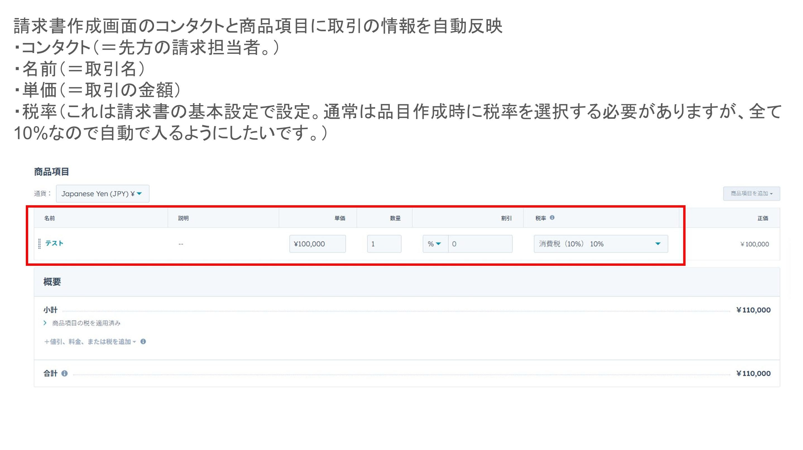
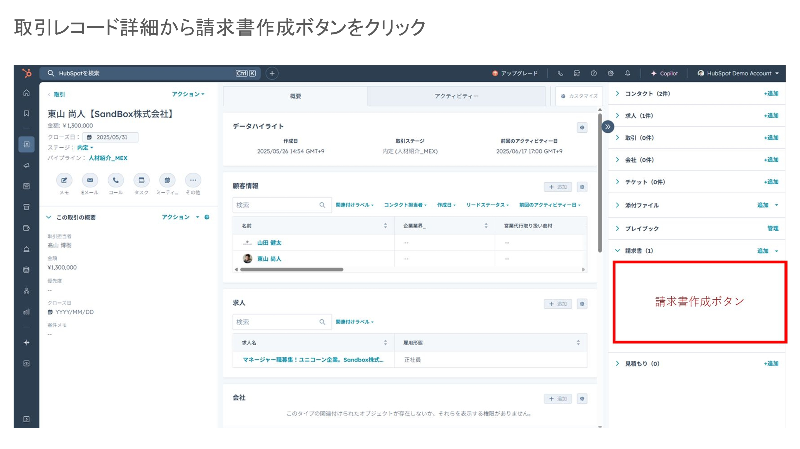
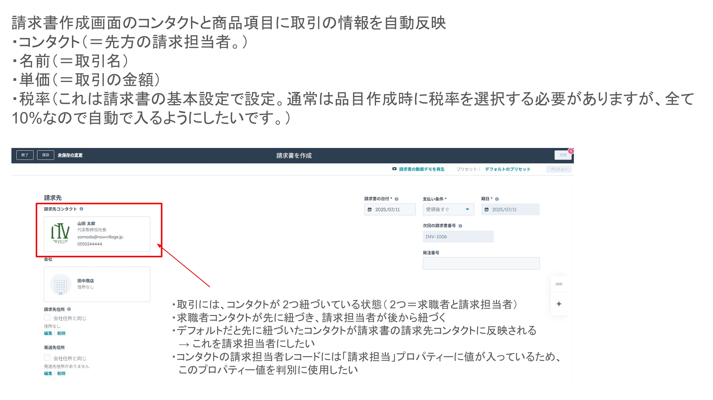

# HubSpot 請求書作成システム

HubSpotのUI ExtensionとServerless関数を使って、取引詳細画面から請求書を作成するシステムです。

## 機能概要

### 請求書作成機能
- **UI Extension**: 取引詳細画面に「請求書作成」ボタンを追加
- **請求書作成画面**: ボタンクリックで請求書作成画面に遷移
- **データ自動取得**: HubSpot APIを使用して以下のデータを自動セット
  - コンタクト情報（請求担当者）
  - 取引名
  - 取引金額（単価）
  - 税率（10%固定）

## 技術スタック

- **HubSpot UI Extensions**: React ベースのフロントエンド
- **HubSpot Serverless Functions**: バックエンドロジック
- **HubSpot APIs**: 
  - Deals API（取引データ取得）
  - Contacts API（コンタクトデータ取得）
  - Associations API（関連データ取得）

## アーキテクチャ

```
取引詳細画面 → UI Extension → Serverless Function → HubSpot APIs
     ↓              ↓              ↓              ↓
  ボタン表示    請求書作成画面    データ処理      データ取得
```

## プロジェクト構成

```
├── src/
│   └── app/
│       ├── extensions/
│       │   ├── InvoiceCreatorExtension.jsx  # 取引画面のボタン
│       │   └── InvoiceCreationForm.jsx      # 請求書作成画面
│       └── functions/
│           ├── getDealData.js               # 取引データ取得
│           └── createInvoice.js             # 請求書作成
├── docs/
│   └── images/                              # スクリーンショット
├── hsproject.json                           # HubSpotプロジェクト設定
├── hubspot.config.yml                       # HubSpot CLI設定
├── package.json                             # 依存関係
├── tsconfig.json                            # TypeScript設定
└── SETUP.md                                 # セットアップガイド
```

## 実装機能

### ✅ UI Extensions
- **取引詳細画面ボタン**: React製のUI Extension
- **請求書作成画面**: フォーム入力とリアルタイム計算
- **エラーハンドリング**: ユーザーフレンドリーなエラー表示

### ✅ Serverless Functions
- **getDealData**: 取引・コンタクトデータの自動取得
- **createInvoice**: 請求書データの作成・保存
- **HubSpot API連携**: Deals API、Contacts API、Associations API

### ✅ 自動データ取得
- **コンタクト情報**: 取引に関連する請求担当者
- **取引名**: 請求書のタイトルとして使用
- **金額**: 取引金額を基本料金として設定
- **税率計算**: 10%固定、リアルタイム計算

### ✅ データ保存
- **取引カスタムプロパティ**: 請求書情報を保存
- **アクティビティノート**: 請求書作成履歴を記録
- **請求書番号**: 自動生成（タイムスタンプベース）

## セットアップ・デプロイ

詳細な手順は [SETUP.md](./SETUP.md) を参照してください。

### クイックスタート

```bash
# 1. 依存関係インストール
npm install

# 2. HubSpot認証（Personal Access Keyを設定）
hs auth personalaccesskey

# 3. 開発環境起動
npm run dev

# 4. デプロイ
npm run deploy
```

### ⚠️ セキュリティ注意事項

- Personal Access Keyやその他の認証情報をコミットしないよう注意してください
- 認証は `hs auth personalaccesskey` コマンドを使用してください
- `.gitignore` により機密情報ファイルは除外されています

## スクリーンショット

### 取引詳細画面


### 請求書作成画面



## 画像の追加方法

画像ファイルを `docs/images/` フォルダに配置し、以下の形式で参照できます：

```markdown

```

